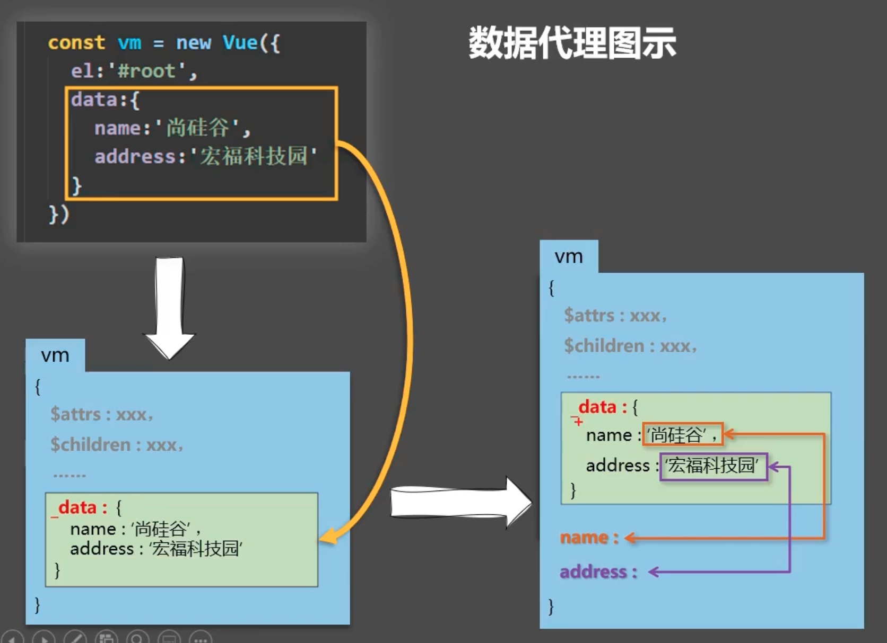

## 数据代理

Vue 首先将data中的数据存储在实例对象vm的 _data 中，然后利用`Object.defineProperty()`把 _data 中的所有属性添加到vm身上，并为每个属性分别创建getter和setter，在getter和setter内部代理操作 _data 中对应的属性，实现数据代理。

## 列表渲染

```html
<ul id="root">
  <!-- <li v-for="(p, index) in persons" :key="index"> -->
  <li v-for="p in persons" :key="p.id">{{p.name}}--{{p.age}}</li>
</ul>
```

```js
new Vue({
  el: "#root",
  data: {
    persons: [
      { id: "01", name: "Leon", age: 18 },
      { id: "02", name: "Jack", age: 23 },
      { id: "03", name: "Tim", age: 15 },
    ],
  },
});
```

v-for 指令可以遍历对象、数组、字符串、指定次数。但常用的仅对象和数组。

## key 的原理

key 可以省略，可以值为 index，也可以值为数据中的 id。

key 的存在与 Vue 的虚拟 DOM 有关。

### 虚拟 DOM 中 key 的作用

key 是虚拟 DOM 中对象的标识，当数据发生变化时，Vue 会根据新数据生成新的虚拟 DOM。随后 Vue 根据新的虚拟 DOM 与旧的虚拟 DOM，进行 Diff 算法比较差异。比较规则如下：

旧虚拟 DOM 中找到了与新虚拟 DOM 相同的 key：

- 若虚拟 DOM 中内容没变, 则直接使用之前的真实 DOM
- 若虚拟 DOM 中内容变了, 则生成新的真实 DOM，随后替换掉页面中之前的真实 DOM

旧虚拟 DOM 中未找到与新虚拟 DOM 相同的 key：创建新的真实 DOM，随后渲染到到页面

### 用 index 作为 key 可能会引发的问题

若对数据进行逆序添加、逆序删除等破坏顺序操作：则会产生没有必要的真实 DOM 更新。虽然界面效果没问题，但效率低。

若结构中还包含输入类的 DOM：则会产生错误 DOM 更新。界面有问题。

### 开发中如何选择 key

最好使用每条数据的唯一标识作为 key，比如 id、手机号、身份证号、学号等唯一值。

当然，如果确认不存在对数据的逆序添加、逆序删除等破坏顺序操作，结构中也不存在输入类 DOM，仅用于渲染列表用于展示，则使用 index 作为 key 也是没有问题的。

## 列表过滤

监视属性和计算属性都可以实现，但计算属性更加简洁。实现如下：

```
<input type="text" placeholder="请输入名字" v-model="keyWord">
<ul>
  <li v-for="(p,index) of filPersons" :key="index">
    {{p.name}}--{{p.age}}
  </li>
</ul>
```

```js
data: {
  keyWord: '',
  persons: [
    { id: "01", name: "马冬梅", age: 18 },
    { id: "02", name: "周冬雨", age: 23 },
    { id: "03", name: "周杰伦", age: 15 },
    { id: "04", name: "温兆伦", age: 47 },
  ]
},

computed: {
  filPersons() {
    return this.persons.filter(p => {
      return p.name.indexOf(this.keyWord) !== -1
    })
  }
}
```

初始化时，计算属性会自动执行一次，此时keyWord为空，所有数据都会通过过滤，所有列表都将被v-for渲染出来。

当输入框中keyWord发生变化，计算属性filPersons重新计算，再由v-for将列表重新渲染，得出过滤结果。

## Vue数据监视：

Vue利用`Object.defineProperty()`设置setter实现数据监视。 _data 中的数据被“数据劫持”，分别添加上setter。当 _data 数据发生变化，setter就会监视到，并调用API更新页面。

但要监视的数据需要在new Vue的时候就传入，后期直接追加的数据Vue默认不会为其添加setter，Vue也监视不到。

### 追加数据的通用方式

1. `Vue.set(target，propertyName/index，value)`

2. `vm.$set(target，propertyName/index，value)`

可以给对象追加属性，也可以给数组追加元素。通过这两种方式追加的数据，Vue可以监视到并更新页面。

### 修改数组中的数据

对于数组中的每个元素，Vue并没有为其匹配getter和setter，所以直接修改数组中的元素，Vue也不会监视到。

不过，Vue通过包装数组对象身上的一些方法，可以监视到由这些方法引起的数组元素改变：`push()` `pop()` `shift()` `unshift()` `splice()` `sort()` `reverse()`，这些都是会影响到原数组的方法。而对于不会影响到原数组的方法，如`filter()`等，则可以通过新数组替换原数组的方式，引起Vue的数据监视。

## 组件VueComponent

Vue中使用组件的三大步骤：定义组件 => 注册组件 => 使用组件。

组件在定义的时候，实质上是在定义构造函数。而组件在使用时，才会被实例化。

> 注意：每次调用`Vue.extend()`，返回的都是一个全新的VueComponent。

为了让组件实例对象vc可以访问到Vue原型上的属性和方法，Vue建立了一个重要的内置关系：

`VueComponent.prototype.__proto__` ===  `Vue.prototype`。

